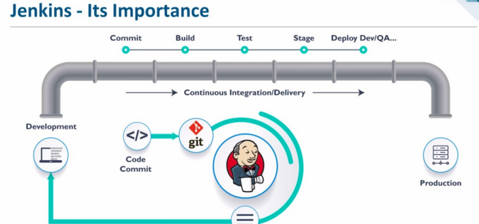

# Let's build a Continuous Integration and Continuous Delivery/Deployment (CICD) Pipeline
## Jenkins
- Jenkins is an open source automation server. It helps automate the parts of software development related to building, testing, and deploying, facilitating continuous integration and continuous delivery.

### Webhooks with Git-hub
- A webhook is a mechanism to automatically trigger the build of a Jenkins project upon a commit pushed in a Git repository. In order for builds to be triggered automatically by PUSH and PULL REQUEST events, a Jenkins Web Hook needs to be added to each GitHub repository.
   
#### Automated Testing using Jenkins
- Jenkins is a popular CI orchestration tool. It provides numerous plugins for integration with multiple test automation tools and frameworks into the test pipeline. When it comes to test automation, Jenkins provides plugins that help run test suites, gather and dashboard results, and provide details on failures.
  
#### Automated Deployment on AWS EC2 for 2Tier architecture - Nodejs app and Mongodb  

- Jenkins Workflow
  


##### Contiounus Integration Continuous Delivery/Deployment 


###### Let's break it down 
  

### For deployment job in Jenkins
- In the execute shell of CD job

```
# we need to by pass the key asking stage with below command:
ssh -A -o "StrictHostKeyChecking=no" ubuntu@ec2-ip << EOF	
# copy the the code
# run your provision.sh to install node with required dependencies for app instance - same goes for db instance (ensure to double check if node and db are actively running)

# create an env to connect to db
# navigate to app folder
# kill any existing pm2 process just in case
# launch the app
nohup node app.js > /dev/null 2>&1 & - use this command to run node app in the background

# To debug ssh into your ec2 and run the above commands
    

EOF
```
## Jenkins CI Lab - Solution

##### Steps
1. create a dev branch
2. checkout dev branch to work on the code and push
3. create a gitHub-webhook `http://jenkinsserverip:8080/github-webhook` to trigger with every commit/push from your local host to trigger this job
4. create a prathima-test job to test the dev branch as soon as the code is pushed and to trigger another job upon success(test pass)
```prathima-test job
GitHub project: `https://github.com/prathimaautomation/devops_jenkins_cicd.git` (enter HTTP url from gitHUB project repo)
Office 365 Connector: select `Restrict where this project can be run: Label Expression: sparta-ubuntu-node` (this help to run the job on the Jenkins agent node rather than Jenkins Master node)
Source Code Management: select `Git`, Repository URL: git@github.com:prathimaautomation/devops_jenkins_cicd.git (SSH URL from github repository)
Credentials: `devops-prathima` (private ssh key)
Branches to build: Branch Specifier: */dev
Build Triggers: select `GitHub hook trigger for GITScm polling`
Build Environment: select `Provide Node & npm bin/folder to PATH
   NodeJS Installation: Sparta-Node-JS
   etc...
Build: Execute shell: Command:
              cd app
              npm install
              npm test
Post-build Acttions: Build other projects: Projects to build: `prathima-merge` and select `Trigger only if build is stable`
Click on Apply and Save
```
5. create a prathima-merge job to merge the dev branch into the main and to trigger another job to deploy the code into the ec2 instance
```prathima-merge job
GitHub project: `https://github.com/prathimaautomation/devops_jenkins_cicd.git` (enter HTTP url from gitHUB project repo)
Office 365 Connector: select `Restrict where this project can be run: Label Expression: sparta-ubuntu-node` (this help to run the job on the Jenkins agent node rather than Jenkins Master node)
Source Code Management: select `Git`, Repository URL: git@github.com:prathimaautomation/devops_jenkins_cicd.git (SSH URL from github repository)
Credentials: `devops-prathima` (private ssh key)
Branches to build: Branch Specifier: */main
Additional Behaviours: Nameof repository: origin
                       Branch to merge to: main
                       Merge strategy: default
                       Fast-forward mode: --ff
Build Triggers: select `GitHub hook trigger for GITScm polling`
Build Environment: select `Provide Node & npm bin/folder to PATH
   NodeJS Installation: Sparta-Node-JS
   etc...
Build: Execute shell: Command:
              git checkout main
              git merge origin/dev
        
Post-build Acttions: 
Git Publisher: select `Merge Results` 

Build other projects: Projects to build: `prathima-deploy` and select `Trigger only if build is stable`
Click on Apply and Save
```
6. create a prathima-deploy job with aws credentials on jenkins to deploy the app on the main branch to copy onto the ec2 instance onthe aws
```prathima-deploy job
GitHub project: `https://github.com/prathimaautomation/devops_jenkins_cicd.git` (enter HTTP url from gitHUB project repo)
Source Code Management: select `Git`, Repository URL: git@github.com:prathimaautomation/devops_jenkins_cicd.git (SSH URL from github repository)
Credentials: `devops-prathima` (private ssh key)
Branches to build: Branch Specifier: */main
Build Triggers: select `GitHub hook trigger for GITScm polling`
Build Environment: select `Provide Node & npm bin/folder to PATH
   NodeJS Installation: Sparta-Node-JS
   etc...
Build: Execute shell: Command:
              ssh -A -o "StrictHostKeyChecking=no" ubuntu@34.254.205.37 << EOF
    export DB_HOST=mongodb://54.194.63.14:27017/posts
    #sudo apt-get update -y
    #sudo apt-get upgrade -y
    #sudo apt-get install nginx -y
    #sudo systemctl restart nginx 
    #sudo systemctl enable nginx
    #scp -
    su - root
    rm -rf devops_jenkins_cicd
    git clone https://github.com/prathimaautomation/devops_jenkins_cicd.git
    cd devops_jenkins_cicd/environment/app
    # cd folder/env/app/
    
    sudo chmod 777 provision.sh
    sudo ./provision.sh
    cd ..
    cd ..
    cd app
    sudo npm install 
    
Post-build Acttions: 
Git Publisher: select `Push Only If BUild Succeeds` 
Branches: Branch to push: main
          Target remote name: origin
Build other projects: Projects to build: `prathima-deploy` and select `Trigger only if build is stable`
Click on Apply and Save
```   
7. Make some changes on the dev branch on localhost and push changes onto gitHub remote, which should trigger prathima-test, which inturn trigger prathima-merge and then prathima-deploy
##### Source Code Management

1. Set Branches to Build to develop
2. Under additional behaviours click add and "Merge before build"
3. name of repo "origin"
4. branch to merge "main"

### Post-Build Actions

#### Git Publisher

1. Add Post Build Action
2. Git Publisher
3. Push Only if Build Succeeds
4. Merge Results

--- 
Tigger deployment job if the merge was successfull
